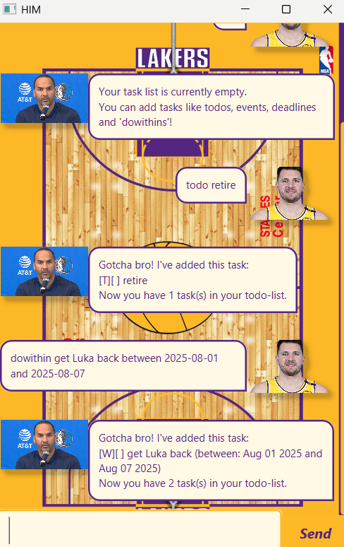

# Him Chatbot User Guide


Him is chatbot for those who want to imoprove their productivity and enjoys typing (using the CLI). Tired of mouse-clicking or writing your tasks on a boring note pad? Him here will make all your troubles go away while constantly reminding you of a special someone! Sounds exciting right? View our Guide on how to 'use Him'!

## Quick Start
Ensure you have Java `17` or above installed in your Computer.
- Download the latest `.jar` file under `Releases`
- Copy the file to the folder you want to use as the home folder for Him.
  <br>**Option 1 (Recommended)**:
- Open your command line terminal and navigate to the home folder of the file
- Type ```java -jar buddy.jar``` to run
  <br>**Option 2**:
- Double-click the file to start the app. The GUI should appear in a few seconds.

## Commands and Formats

| **Command**  | **Format** |
|-------------|-----------------------------------------|
| **List** | `list` |
| **Add To-Do** | `todo <description>` |
| **Add Event** | `event <description> from <start> to <end>` |
| **Add Deadline** | `deadline <description> by <date time>` |
| **Add DoWithin** | `dowithin <description> between <date time> and <date time>` |
| **Find a Keyword** | `find <task>` |
| **Mark as Done** | `done <task number>` |
| **Unmark as Not Done** | `undone <task number>` |
| **Delete Task** | `delete <task number>` |
| **Exit** | `bye` |

Examples: `keyword (optional arguments)`
* **Todo** `todo <description>`<br> e.g. `todo tut1`
* **Deadline** `deadline <description> by DUE_DATE` <br>
  e.g. `deadline quiz 6 by 2025-12-02 1000`
* **Event** `event <description> from START_DATE to END_DATE` <br>
  e.g. `event team bonding from 2024-02-02 1400 to 2024-02-02 1600`
* **DoWithin** `dowithin <description> between START_DATE and END_DATE` <br>
  e.g. `dowithin collect parcel from 2024-02-02 1400 to 2024-02-02 1600`
* **Delete** : `delete INDEX` <br> e.g. `delete 3`
* **Done** : `done INDEX` <br> e.g. `done 1`
* **Undone** : `undone INDEX` <br>
  e.g. `undone 2`
* **Find** : `find KEYWORD` <br>
  e.g. `find homework`
* **List** : `list`
* **Bye** : `bye`

## Saving and Editing your Tasks
- Him **automatically saves your tasks**, so next time you load the chatbot back and **list** your tasks, it'll pop up!
- Your tasks are stored in a file called `him.txt` under the `data` folder.
- If the `him.txt` file is missing, Him will create a new one with an empty task list.
- **Manually editing `him.txt`**:
  - You can modify `him.txt` using a text editor too!
  - Ensure that the format remains unchanged to avoid data corruption.
